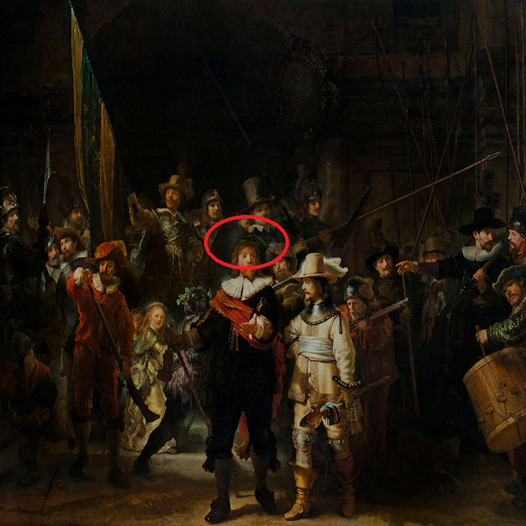
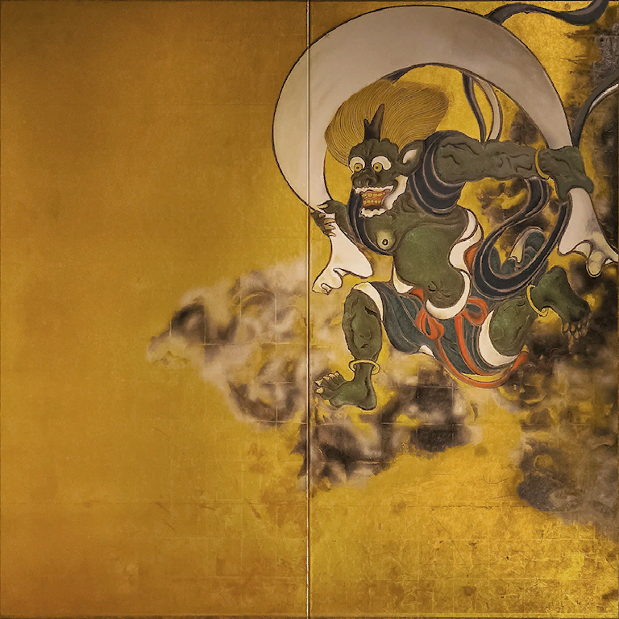
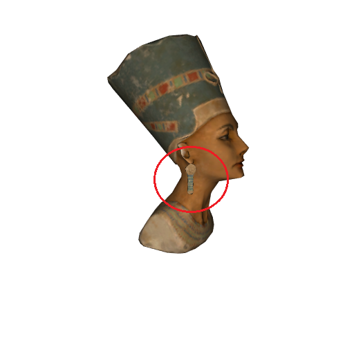

<!DOCTYPE html>
<head>
    <meta charset="utf-8">
    <title>미술품 구별하기</title>
    
</head>
<body>
    <a name="tag1"><h2>아카데믹한 명화</h2></a>
    <table border="2">
        <tr>
            <td></td>
            <td></td>
        </tr>
        <tr>
            <td>진품</td>
            <td>가품</td>
        </tr>
    </table>
     
    <a name="tag2"><h2>대단한 명화</h2></a>
    <table border="2">
        <tr>
            <td></td>
            <td></td>
        </tr>
        <tr>
            <td>진품</td>
            <td>가품</td>
        </tr>
    </table>
     
    <a name="tag3"><h2>용감한 명화</h2></a>
    <table border="2">
        <tr>
            <td></td>
            <td></td>
        </tr>
        <tr>
            <td>진품</td>
            <td>가품</td>
        </tr>
    </table>
     
    <a name="tag4"><h2>섬세한 명화</h2></a>
    <table border="2">
        <tr>
            <td></td>
            <td></td>
        </tr>
        <tr>
            <td>진품</td>
            <td>가품</td>
        </tr>
    </table>
     
    <a name="tag5"><h2>유명한 명화</h2></a>
    <table border="2">
        <tr>
            <td></td>
            <td></td>
        </tr>
        <tr>
            <td>진품</td>
            <td>가품</td>
        </tr>
    </table>
     
    <a name="tag6"><h2>절제된 명화</h2></a>
    <table border="2">
        <tr>
            <td></td>
            <td></td>
            <td></td>
        </tr>
        <tr>
            <td>진품</td>
            <td>가품1</td>
            <td>가품2</td>
        </tr>
    </table>
     
    <a name="tag7"><h2>재미있는 명화</h2></a>
    <table border="2">
        <tr>
            <td></td>
            <td></td>
        </tr>
        <tr>
            <td>진품</td>
            <td>가품</td>
        </tr>
    </table>
     
    <a name="tag8"><h2>예쁜 명화</h2></a>
    <table border="2">
        <tr>
            <td></td>
            <td></td>
        </tr>
        <tr>
            <td>진품</td>
            <td>가품</td>
        </tr>
    </table>
     
    <a name="tag9"><h2>침착한 명화</h2></a>
    <table border="2">
        <tr>
            <td></td>
            <td></td>
        </tr>
        <tr>
            <td>진품</td>
            <td>가품</td>
        </tr>
    </table>
     
    <a name="tag10"><h2>씩씩한 명화</h2></a>
    <table border="2">
        <tr>
            <td></td>
            <td></td>
            <td></td>
        </tr>
        <tr>
            <td>진품</td>
            <td>가품1</td>
            <td>가품2</td>
        </tr>
    </table>
     
    <a name="tag11"><h2>뛰어난 명화</h2></a>
    <table border="2">
        <tr>
            <td></td>
            <td></td>
        </tr>
        <tr>
            <td>진품</td>
            <td>가품</td>
        </tr>
    </table>
     
    <a name="tag12"><h2>아늑한 명화</h2></a>
    <table border="2">
        <tr>
            <td></td>
            <td></td>
        </tr>
        <tr>
            <td>진품</td>
            <td>가품</td>
        </tr>
    </table>
     
    <a name="tag13"><h2>엄숙한 명화</h2></a>
    <table border="2">
        <tr>
            <td></td>
            <td></td>
        </tr>
        <tr>
            <td>진품</td>
            <td>가품</td>
        </tr>
    </table>
     
    <a name="tag14"><h2>혼란스러운 명화의 오른쪽</h2></a>
    <table border="2">
        <tr>
            <td></td>
            <td></td>
        </tr>
        <tr>
            <td>진품</td>
            <td>가품</td>
        </tr>
    </table>
     
    <a name="tag15"><h2>혼란스러운 명화의 왼쪽</h2></a>
    <table border="2">
        <tr>
            <td></td>
            <td></td>
        </tr>
        <tr>
            <td>진품</td>
            <td>가품</td>
        </tr>
    </table>
     
    <a name="tag16"><h2>근사한 명화</h2></a>
    <table border="2">
        <tr>
            <td></td>
            <td></td>
            <td></td>
        </tr>
        <tr>
            <td>진품</td>
            <td>가품1</td>
            <td>가품2</td>
        </tr>
    </table>
     
    <a name="tag17"><h2>태고의 조각</h2></a>
    <table border="2">
        <tr>
            <td></td>
            <td></td>
        </tr>
        <tr>
            <td>진품</td>
            <td>가품</td>
        </tr>
    </table>
     
    <a name="tag18"><h2>아름다운 조각</h2></a>
    <table border="2">
        <tr>
            <td></td>
            <td></td>
        </tr>
        <tr>
            <td>진품</td>
            <td>가품</td>
        </tr>
    </table>
     
    <a name="tag19"><h2>늠름한 조각</h2></a>
    <table border="2">
        <tr>
            <td></td>
            <td></td>
        </tr>
        <tr>
            <td>진품</td>
            <td>가품</td>
        </tr>
    </table>
     
    <a name="tag20"><h2>단서가 되는 조각</h2></a>
    <table border="2">
        <tr>
            <td></td>
            <td></td>
        </tr>
        <tr>
            <td>진품</td>
            <td>가품</td>
        </tr>
    </table>
     
    <a name="tag21"><h2>모성이 느껴지는 조각</h2></a>
    <table border="2">
        <tr>
            <td></td>
            <td></td>
        </tr>
        <tr>
            <td>진품</td>
            <td>가품</td>
        </tr>
    </table>
     
    <a name="tag22"><h2>신비로운 조각</h2></a>
    <table border="2">
        <tr>
            <td></td>
            <td></td>
        </tr>
        <tr>
            <td>진품</td>
            <td>가품</td>
        </tr>
    </table>
     
    <a name="tag23"><h2>듬직한 조각</h2></a>
    <table border="2">
        <tr>
            <td></td>
            <td></td>
        </tr>
        <tr>
            <td>진품</td>
            <td>가품</td>
        </tr>
    </table>
     
    <a name="tag24"><h2>돌 머리의 조각</h2></a>
    <table border="2">
        <tr>
            <td></td>
            <td></td>
        </tr>
        <tr>
            <td>진품</td>
            <td>가품</td>
        </tr>
    </table>
     
    <a name="tag25"><h2>어마어마한 조각</h2></a>
    <table border="2">
        <tr>
            <td></td>
            <td></td>
        </tr>
        <tr>
            <td>진품</td>
            <td>가품</td>
        </tr>
    </table>
     
    <a name="tag26"><h2>거룩한 조각</h2></a>
    <table border="2">
        <tr>
            <td></td>
            <td></td>
        </tr>
        <tr>
            <td>진품</td>
            <td>가품</td>
        </tr>
    </table>
     
    <a name="tag27"><h2>무사의 조각</h2></a>
    <table border="2">
        <tr>
            <td></td>
            <td></td>
        </tr>
        <tr>
            <td>진품</td>
            <td>가품</td>
        </tr>
    </table>
     
    <a href="#tag1">맨위 이동</a>
</body>
